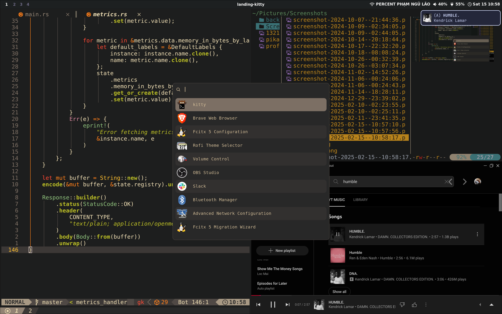

# NixOS & Hyprland

## About

This repository contains my NixOS Linux configuration using `flake`, featuring the Hyprland window manager. I use this setup as my daily driver for work and programming. Feel free to use it as-is or adapt specific components for your own configuration.

Please note that this setup is not (yet) minimalistic, lightweight, or fully optimized, as I am still learning and experimenting.

## Components

- **Distro**: NixOS
- **Terminal**: Kitty
- **Shell**: Zsh
- **Display server**: Wayland
- **Window manager**: Hyprland
- **Bar**: Waybar
- **Launcher**: Rofi-Wayland
- **Wallpaper**: Hyprpaper
- **Lock screen**: Hyprlock
- **File manager**: Yazi
- **Browser**: Brave
- **Screenshot**: Grim + Slurp 

## TODOs

- Configure dotfiles (home manager or chezmoi?)
- Unify the gruvbox colorscheme across all components
- Fix `fcitx5` input method
